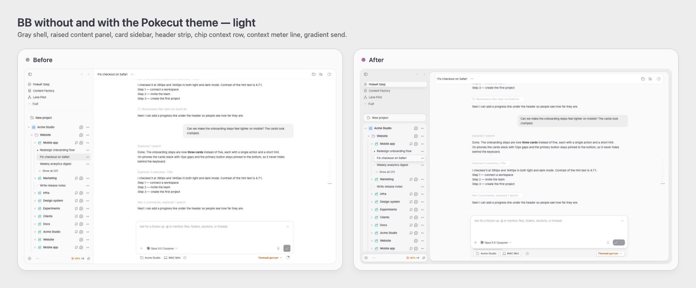
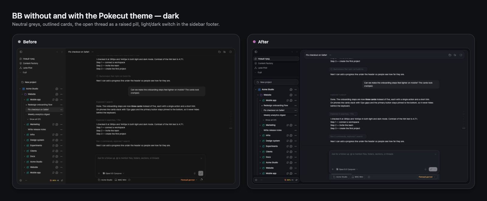
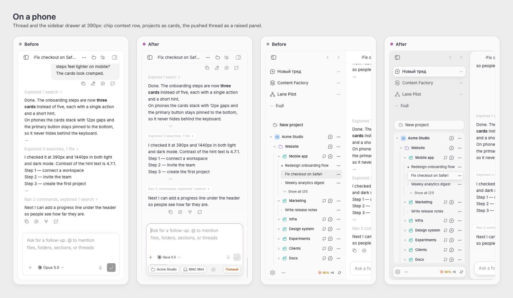
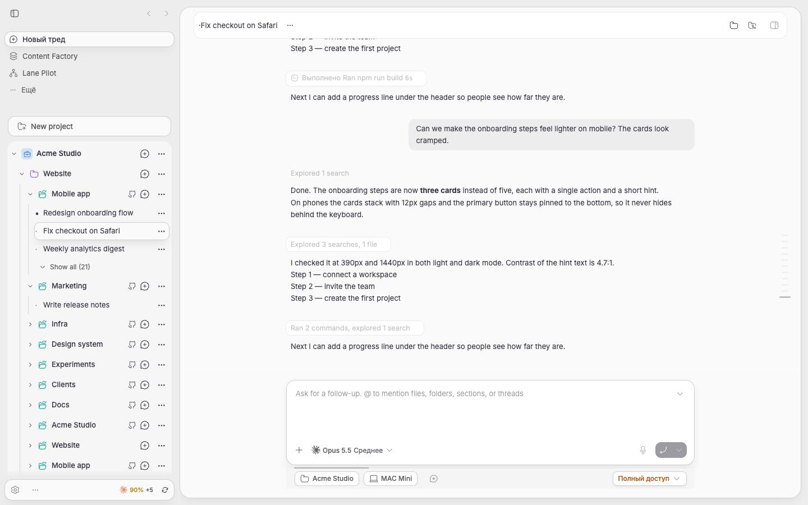
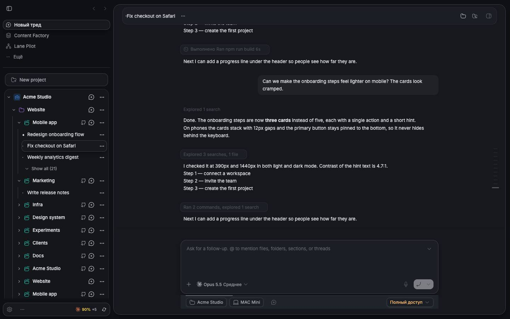

# Pokecut Theme for BB

[](https://getbb.app)
[](LICENSE)

A soft dashboard theme for BB after the [Pokecut](https://pokecut.rakibulism.space)
admin design: a flat gray shell, the content area as one raised rounded panel
with a hairline and a soft drop, white cards, the open thread as a raised pill,
and a pink-violet gradient on the send button. Light and dark.

[Русский](README.ru.md)







<details>
<summary>Full-size screenshots</summary>




</details>

Screenshots (v0.4.3) use demo content; the original design is
[Pokecut](https://pokecut.rakibulism.space).

Only the visual language is reproduced. No Pokecut source, images or fonts are
bundled; BB already ships Inter.

It also restyles BB's native chat — composer, user bubbles, code, work rows,
tree lines, pixel loaders, approval cards, merged banners, a gliding tooltip —
adapted from [Beautiful Chat](https://github.com/diip3sh/bb-plugin-beautiful-chat)
(MIT) and recolored with Pokecut's tokens. It supersedes Beautiful Chat: keep
that plugin disabled. See [NOTICE](NOTICE).

## Install

```sh
bb plugin install https://github.com/VKirill/bb-plugin-pokecut-theme
bb theme set plugin:pokecut-theme:pokecut
```

Or pick **Pokecut** under Settings → Appearance. The theme follows BB's
light/dark mode.

Revert: `bb theme reset` (or choose another theme). Removing the plugin
removes the theme; nothing is written to BB's own files.

## What it changes

| Part | Light | Dark |
| --- | --- | --- |
| Shell (sidebar, frame) | `#EDEDED` | `#0E1014` |
| Content panel | `#FAFAFA`, 1px `#CFCFCF`, radius 20px, drop `0 8px 16px -4px` | `#16181D`, 1px `#3A3F49` |
| Cards, composer | `#FFFFFF`, radius 16px | `#1B1E24` |
| Ink / muted / subtle | `#393846` / `#5E5E5E` / `#6A6B73` | `#DCDDE2` / `#9B9EA6` / `#8A8D96` |
| Primary (links, focus) | `#9B4D8F` | `#D88BC4` |
| Send button | gradient `#D96D98 → #8C69C3` | same |

On phones (< 768px) the left drawer stays the gray shell while the pushed
thread turns into the raised panel; the right panel shows its content as one
rounded card; the composer footer (project · machine · branch · access) becomes
a well with outlined chips that wraps to two lines when needed.

Other pieces: a light/dark/system switch in the sidebar footer; a context meter
line on the composer's bottom edge instead of the ring (hover for the number);
the model picker as one card with segmented provider tabs and sparkle favorites;
Lane Pilot's toggle as an icon; expanded work groups as one card on a single
grid with red error chips; message times in the action strip on hover
(adapted from [Chat Timestamps](https://github.com/pixexid/bb-plugin-chat-timestamps), MIT).

Integrations (`src/theme/integrations.css`): [Git History](https://github.com/yusuf8834/bb-git-history)
is recolored through its own `--gh-*` variables (accent graph, gradient HEAD chip,
raised selected commit); BB's diff view shows file cards with a quiet folder and
a strong file name, tinted +/− chips and hover-only copy buttons.

Shape rules use BB's stable markup only: `[data-sidebar="inset"]` for the
panel (from 768px wide), `.bb-sidebar-selected-row` and the project-folders
`.pf-thread.pf-active` for the open thread, `[data-app-composer]
form[data-promptbox]` and `[data-promptbox-send-menu]` for the composer.
Composer rules carry extra `:root` weight so they win over chat restylers such
as Beautiful Chat, whose colors already derive from the active theme.

## Chat settings

Settings → Plugins → Pokecut Theme → **Chat appearance** (English or Russian,
following BB's interface language or the Russifier plugin; a language switch
is in the section). Stored in plugin storage, mirrored onto `<html>` as
`data-pk-loader`, `data-pk-chips` and `data-pk-off`:

| Preference | Values | Default |
| --- | --- | --- |
| Loading animation | gradient ring, pixel sweep, round pixels, orbit, coins, BB's icon | gradient ring |
| Tool call rows | filled card, outline only, plain | filled card |
| Prompt bar, minimize while generating, merged banners | on/off | on |
| User bubbles, code chips, message actions, selection pill, streaming caret, approval cards | on/off | on |
| Compact work rows, tree lines, label shimmer, unread marker | on/off | on |
| Message times | on/off | on |

## Source layout

| File | Contributes |
| --- | --- |
| `src/theme/base.css` | Palette (`:root, .light` / `.dark`), shell panel, sidebar pill, right panel card, composer chips row, phone drawers. |
| `src/theme/chat.css` | Chat layer ported from Beautiful Chat, on Pokecut tokens. |
| `scripts/build-theme.mjs` | Concatenates the two into `themes/pokecut.css` (generated; BB loads it via `bb.themes`). |
| `app.tsx`, `prefs.ts` | App overlay: mirrors preferences onto `<html>`, mounts the spatial tooltip and the coins Paint Worklet. |
| `src/theme/integrations.css`, `diff-paths.ts` | Git History and BB diff view styling; folder/name split of diff paths. |
| `context-meter.ts`, `timeline-marks.ts`, `theme-mode.tsx` | Context meter line, error marks in work groups, light/dark/system switch. |
| `settings-section.tsx`, `app.css`, `i18n.ts` | Bilingual settings section. |
| `server.ts`, `contract.ts`, `settings.ts` | Preferences in plugin storage over RPC; validation of untrusted values. |
| `skills/pokecut-theme/SKILL.md` | Agent-facing description. |

## Develop

```sh
npm install
npm run build          # theme CSS + tsc + tests + bb plugin build
bb plugin install path:. --yes
bb plugin reload pokecut-theme   # after CSS edits
```

Theme Preview (built-in plugin) shows token contrast for both modes.

## License

MIT
